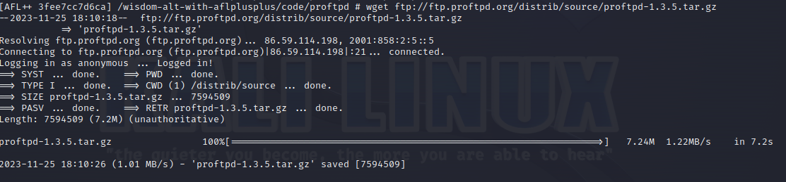
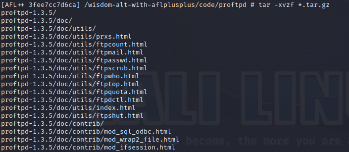

1. Скачал [Kali](https://www.kali.org/get-kali/#kali-virtual-machines) для VMware
2. Запустил Kali (kali/kali)
3. Установил [AFLplusplus](https://github.com/AFLplusplus)
   1. Установил Docker 
   2. Запустил Docker 
   3. Скачал образ AFLplusplus 
   4. Запустил образ AFLplusplus 
4. Начал работать с AFLplusplus 
   1. Начал тестировать [wisdom-alt](https://github.com/KarenWest/softwareSecurity/blob/master/wisdom-alt.c)
      1. Скомпилировал `wisdom-alt.c` с помощью специального компилятора `afl-cc` 
      2. Создал специальный файлик с валидными входными параметрами 
      3. Запустил `fuzzинг` 
      4. Подождал какое то время и остановил тестирование 
      5. Проверил результаты `crachей` 
   2. Начал тестировать [proftp](http://www.proftpd.org)
      1. Скачал "правильную" версию `proftp` с помощью `wget ftp://ftp.proftpd.org/distrib/source/proftpd-1.3.5.tar.gz` 
      2. Распаковал 
      3. Собрал 1/3 
      4. Собрал 2/3 
      5. Собрал 3/3 
      6. Запустил с помощью `./proftpd -n` 
      7. ...
      8. ... ...
      9. ... ... ...
      10. ... ... ... ...
      11. ... ... ... ... ...
5. Собрал отчет
   1. Формочка-текст такой же как этот список
   2. Фотографии в папке `img`
   3. Пример вывода фазинга для каждого кода в соответствующей папке в `code`