1. Скачал [Kali](https://www.kali.org/get-kali/#kali-virtual-machines) для VMware
2. Запустил Kali (kali/kali)
3. Установил [AFLplusplus](https://github.com/AFLplusplus)
   1. Установил Docker 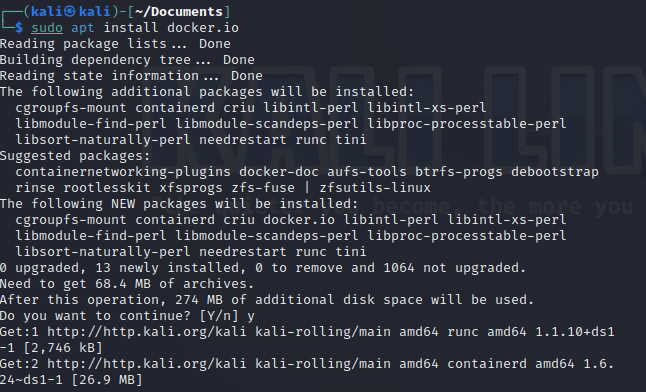
   2. Запустил Docker 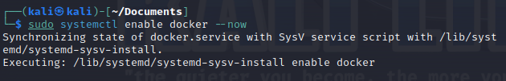
   3. Скачал образ AFLplusplus 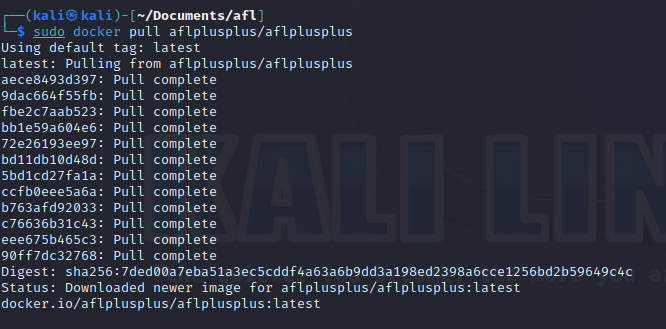
   4. Запустил образ AFLplusplus 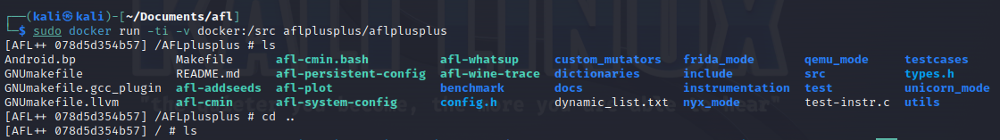
4. Начал работать с AFLplusplus 
   1. Начал тестировать [wisdom-alt](https://github.com/KarenWest/softwareSecurity/blob/master/wisdom-alt.c)
      1. Скомпилировал `wisdom-alt.c` с помощью специального компилятора `afl-cc` 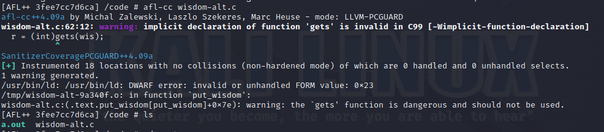
      2. Создал специальный файлик с валидными входными параметрами 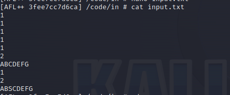
      3. Запустил `fuzzинг` 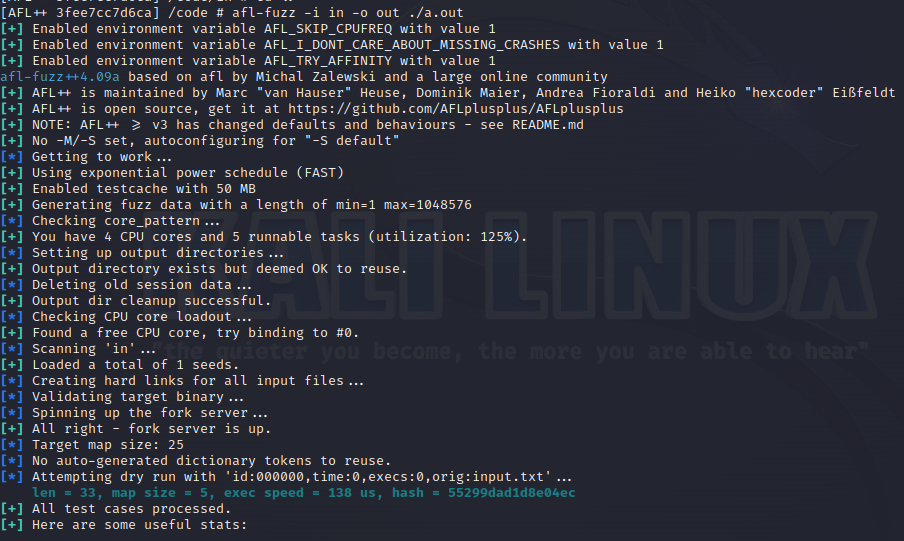
      4. Подождал какое то время и остановил тестирование 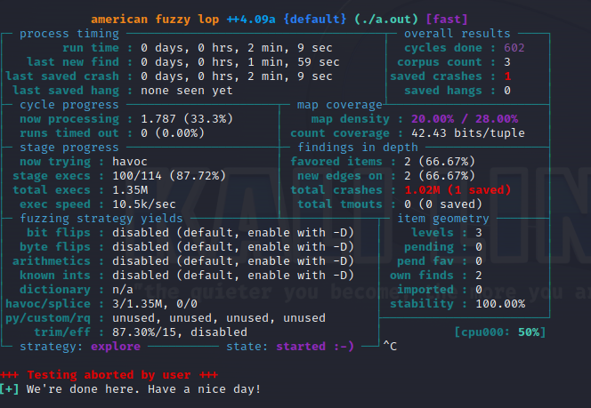
      5. Проверил результаты `crachей` 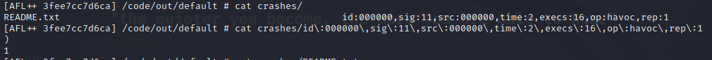
   2. `*` Начал тестировать [proftp](http://www.proftpd.org) 
      1. Скачал "правильную" версию `proftp`. Её в интернетах нет, поэтому вытащил архив из виртуалки лабы прошлого семестра - код в папке `code/proftpd/ftp-server`
      2. Собрал 1/3 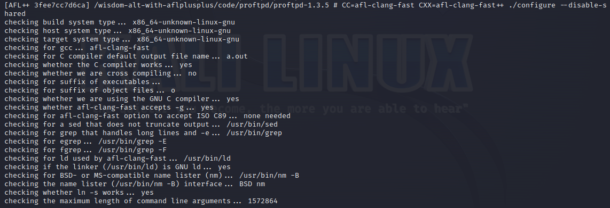
      3. Собрал 2/3 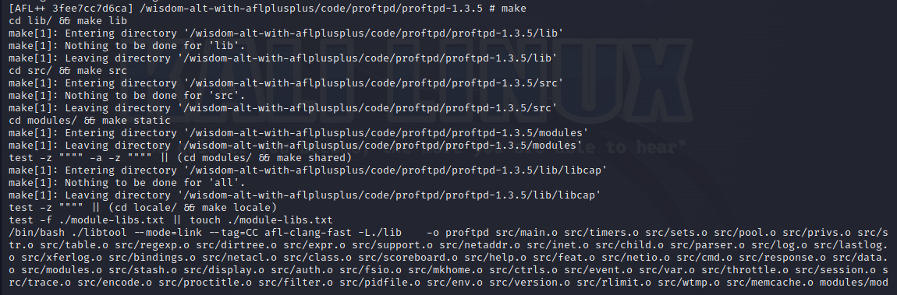
      4. Собрал 3/3 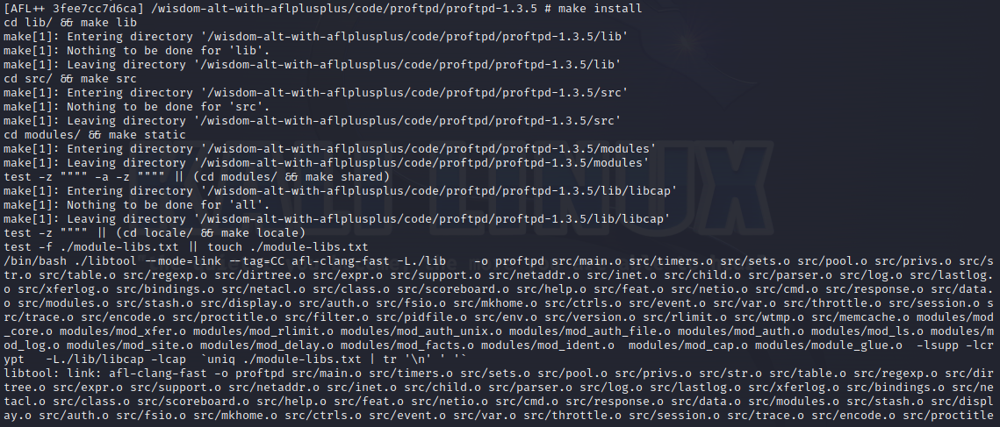
      5. Запустил с помощью `./proftpd -n` 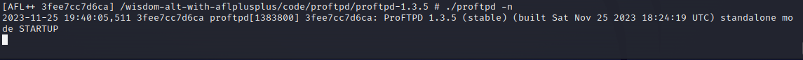
      6. Если всё запустилось, значит компиляция работает правильно
      7. `*` Выделили функцию `pr_netio_raw_buffer_read()` в отдельный файлик
      8. `*` Напишем в этом же файлике функцию `main()`, в которой вызывем исследуюмую функцию
      9. `*` В качетве входного второго аргумента `buf` для функции `pr_netio_raw_buffer_read()` передадим данные из вне, т.е считаем их с помощью `scanf`
      10. `*` Скомпилируем полученный файлик с помощью `afl-cc`
      11. `*` Создадим файлик с валидными входными данными
      12. `*` Запустим фазинг с помощью `afl-fuzz -i in -o out ./a.out`
      13. `*` Выключим фазинг через какое то время
      14. `*` Проверим результаты `crashей`
5. Собрал отчет
   1. Формочка-текст такой же как этот список
   2. Фотографии в папке `img`
   3. Пример вывода фазинга для каждого кода в соответствующей папке в `code`

`*` - пункты, помеченные этим символом, идеальной версией (такой как было задумано автором-преподавателем) выполнения лабораторной. В жизни эти 
пункты сложнее по ряду причин, которые мне не удалось преодолеть или удалось частично. Со всеми подробностями можно ознакомится [тут](troubleshooting/proftpd-trouble.md)